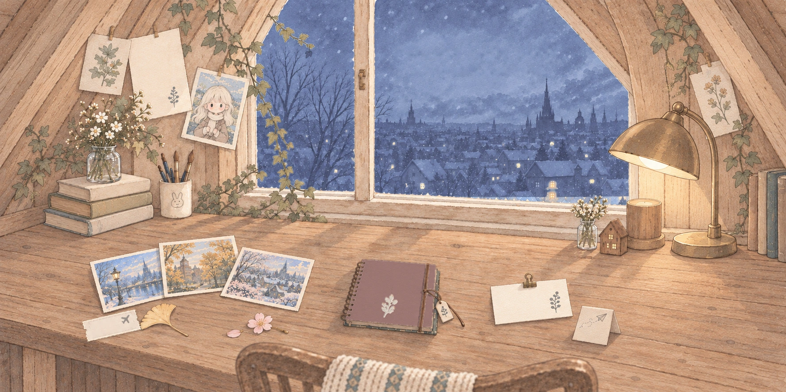

# Peiwen's Little World

**My HCI portfolio: a bilingual, hand-drawn picture-book world. You explore it by clicking things on a desk.**

**Live site: [peiwen-little-world.vercel.app](https://peiwen-little-world.vercel.app)** · Best viewed on a computer



I'm Peiwen Zhang, an MSc HCI student at Université Paris-Saclay. I build AI products people can understand and control, drawing on product work and a technical background in AI. Instead of a grid of project cards, this portfolio is a hand-drawn attic room: the postcards on the desk lead to my experience, the notebook to who I am, and the pinned card to my projects.

## What's inside

| Where | What you'll find |
| --- | --- |
| **Home** (the desk) | A short opening (open the window, switch on the lamp, with a tiny flower fairy showing the way), then a lit desk where each object opens a page |
| **Experience** (the path) | My route from Communication University of China, through an exchange in Osaka, to Paris-Saclay, shown as stops along a road |
| **Projects** (the house) | Eight case studies, from emotional captions to VR locomotion and 3D-printed objects |
| **About** (the notebook) | A notebook you can flip through: who I am, my journey and what I like outside of work. CV download (EN / 中文) and a postcard that really sends me a message |

### Projects

- **Reso:** emotional captions, with prototypes, an evaluation with hearing participants as proxy users, and iterations based on the results
- **Arm-Swing VR Locomotion:** controller swing and headset direction mapped to continuous 3D travel
- **Tangram:** a modular Tangram set, built through connector experiments and 3D printing
- **Multi-Sensory Music VR:** note blocks and a moving scan line linked to sound, particles and controller vibration
- **Maze of Wishes:** a Java maze you play by tilting your phone (sensor mapping, calibration, collisions)
- **Flight Booking Experience:** problems found in Story Interviews, turned into a clearer mobile booking flow
- **Chess:** a one-week concept that designs the chess experience around why people play
- **ZOO Desk Organizer:** an animal-inspired desk organizer made with CAD and 3D printing

## Interaction and accessibility details

- **The opening:** the room starts dark and a tiny guide lights one thing at a time, first the window, then the lamp. A detailed illustration shown all at once can leave first-time visitors not knowing where to look. Starting in the dark points them to one object at a time and shows, in two clicks, that things in the room can be clicked.
- **Bilingual:** a 中 / EN switch on every page, with a handwritten Chinese font so the Chinese version keeps the same look.
- **"Ask me" companion:** a little Peiwen in the corner answers common questions and links to the right page.
- **Accessibility:** `prefers-reduced-motion` skips the opening and the animations, every hotspot is a labelled button you can reach by keyboard, and decorative images are hidden from screen readers.
- **Landscape layout:** phones held upright get a "turn your phone sideways" card instead of a broken layout.
- **Sound:** shuffled background music, soft white noise and the occasional cat meow.
- **Small extras:** a watercolour transition between pages, a custom 404 page, a favicon and a share image.

## Built with

- [Next.js 16](https://nextjs.org) (App Router) · React 19 · TypeScript
- CSS Modules + Tailwind CSS v4
- Hand-drawn 2D illustration layers for the visuals, DOM for content and accessibility, React Three Fiber / three.js for spatial experiments
- [Web3Forms](https://web3forms.com) for the postcard, deployed on [Vercel](https://vercel.com)

## Run it locally

```bash
npm ci
npm run dev        # http://localhost:3000
```

Checks: `npm run lint` · `npm run typecheck` · `npm run build`

To make the About-page postcard send real mail, copy `.env.example` to `.env.local` and add a Web3Forms access key.

## Process notes

Design and build decisions are documented in the repo: [`VISUAL_DIRECTION.md`](VISUAL_DIRECTION.md) (art direction), [`STYLE_GUIDE.md`](STYLE_GUIDE.md), [`ASSET_INDEX.md`](ASSET_INDEX.md) (illustration sources and derivatives) and [`PROJECT_STATE.md`](PROJECT_STATE.md) (implementation log).

Some technical architecture patterns were studied from [ITom's portfolio](https://github.com/ITomPoland/portfolio-itom). No artwork, branding, content or composition was reused.

## License

© Peiwen Zhang. All rights reserved. Code and artwork may not be reused without permission.
